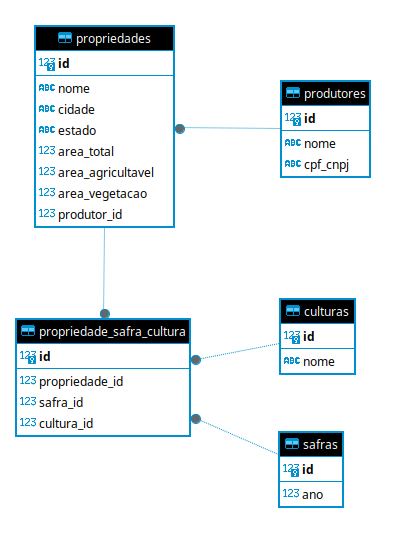

# TestBrainAgriculture

Este projeto foi desenvolvido como parte de um teste técnico para a empresa **Brain Agriculture**, referente à vaga de **Desenvolvedor Backend**. \
A proposta é criar uma aplicação para gerenciar o cadastro de produtores rurais, com os seguintes dados:


## Diagrama da Arquitetura



### Tabela de Campos Obrigatórios

| Entidade                        | Campo                | Tipo         | Obrigatório | Observação                                      |
|----------------------------------|----------------------|--------------|-------------|-------------------------------------------------|
| **ProdutorRural**                | nome                 | string       | Sim         |                                                 |
|                                  | cpf_cnpj             | string       | Sim         | Deve ser CPF ou CNPJ válido e único             |
| **Propriedade**                  | nome                 | string       | Sim         |                                                 |
|                                  | cidade               | string       | Sim         |                                                 |
|                                  | estado               | string       | Sim         |                                                 |
|                                  | area_total           | float        | Sim         | > 0                                             |
|                                  | area_agricultavel    | float        | Sim         | > 0                                             |
|                                  | area_vegetacao       | float        | Sim         | > 0                                             |
|                                  | produtor_id          | int          | Sim         | FK para ProdutorRural                           |
| **Safra**                        | ano                  | int          | Sim         | Entre 1900 e 2100                               |
| **Cultura**                      | nome                 | string       | Sim         |                                                 |
| **PropriedadeSafraCultura**      | propriedade_id       | int          | Sim         | FK para Propriedade                             |
|                                  | safra_id             | int          | Sim         | FK para Safra                                   |
|                                  | cultura_id           | int          | Sim         | FK para Cultura                                 |

**Observações:**
- Todos os campos listados como obrigatórios são validados na API.
- Para propriedades, a soma de `area_agricultavel` + `area_vegetacao` não pode ultrapassar `area_total`.
- O campo `cpf_cnpj` do produtor deve ser único no sistema.


## Documentação

- [Especificação OpenAPI](docs/OPENAPI_SPEC.md) - Especificação completa da API


## Como rodar o projeto

### Usando Makefile

```bash
# Configurar o projeto (primeira vez)
make setup

# Subir todos os serviços (API + Dashboard + DB)
make run

# Parar todos os serviços (API + Dashboard + DB)
make stop

# Popular banco com dados mockados
make seed

# Rodar testes
make test
```

### Usando Docker Compose diretamente
```bash
# Todos os serviços
docker compose up -d

# Parar todos os serviços
docker compose down

# Popular banco com dados mockados
docker compose exec api uv run python -m app.utils.seed_data

# Rodar migrações
docker compose exec api uv run alembic upgrade head

# Rodar testes
docker compose exec api uv run pytest -v
```

## Acessos

- Dashboard Streamlit: http://localhost:8501
- API Documentação (Swagger): http://localhost:8008/docs
- API Base URL: http://localhost:8008

## Comandos úteis

- `make help` - Mostra todos os comandos disponíveis
- `make setup` - Configurar o projeto (primeira vez)
- `make run` - Subir todos os containers (API + Dashboard + DB)
- `make stop` - Parar os containers
- `make api-only` - Rodar apenas API e banco
- `make dashboard` - Rodar apenas o dashboard
- `make migrate` - Executar migrações
- `make seed` - Popular banco com dados mockados (Faker)
- `make seed-force` - Forçar população (apaga dados existentes)
- `make test` - Rodar todos os testes
- `make test-coverage` - Rodar testes com cobertura
- `make test-unit` - Rodar apenas testes unitários
- `make test-integration` - Rodar apenas testes de integração
- `make logs` - Ver logs dos containers
- `make shell` - Acessar shell do container da API
- `make db-shell` - Acessar shell do banco de dados

## Dados Mockados

### População Automática
O projeto inclui um sistema de dados mockados usando a biblioteca Faker:

```bash
# Popular banco com dados mockados (padrão)
make seed

# Forçar população (apaga dados existentes)
make seed-force
```

## Funcionalidades

### Dashboard Streamlit
- Total de fazendas cadastradas (quantidade).
- Total de hectares registrados (área total).
- Gráficos de pizza:  Por estado, Por cultura plantada, Por uso do solo (área agricultável e vegetação).

### API Endpoints
- `/produtores` - CRUD de produtores rurais
- `/propriedades` - CRUD de propriedades
- `/safras` - CRUD de safras
- `/culturas` - CRUD de culturas
- `/propriedade-safra-cultura` - Associações de plantio
- `/dashboard` - Dados para gráficos e estatísticas

## Testes

### Estrutura de Testes
- Testes Unitários: Validação de lógica de negócio
- Testes de Integração: Validação de endpoints da API
- Dados Mockados: Fixtures com dados de teste
- Cobertura: Relatórios de cobertura de código

### Comandos de Teste
```bash
make test              # Todos os testes
make test-coverage     # Testes com cobertura
make test-unit         # Apenas testes unitários
make test-integration  # Apenas testes de integração
```

## Observabilidade

### Sistema de Logs
- Logs Estruturados: Formato padronizado com timestamps
- Rotação Automática: Logs rotacionados por tamanho e tempo
- Níveis de Log: DEBUG, INFO, WARNING, ERROR
- Arquivos Separados: Logs de aplicação e erros separados
- Monitoramento: Logs de requisições, operações de banco e validações

### Logs Disponíveis
- `logs/app.log` - Logs gerais da aplicação
- `logs/errors.log` - Logs de erros específicos
- Console - Logs em tempo real durante desenvolvimento

## Tecnologias Utilizadas

- Backend: FastAPI + SQLAlchemy + PostgreSQL
- Dashboard: Streamlit + Plotly
- Testes: Pytest + TestClient
- Logs: Loguru
- Dados Mockados: Faker
- Gerenciador de Pacotes: uv
- Containerização: Docker + Docker Compose
- Migrações: Alembic
